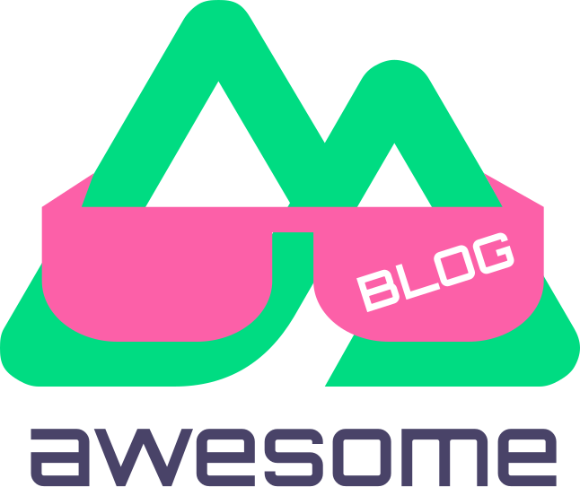

   
  
   
   

# Awesome Nuxt Blog

A curated collection of blog starters built with Nuxt3

**"Don’t reinvent the wheel. Start your blog with a starter kit and focus on creating original content."**

> If you want to add your Nuxt3 blog, open an issue with the GitHub repo link, and I'll add it. A live demo is required.

## Starter Kits

### Alpine

[Github](https://github.com/nuxt-themes/alpine) / [Live Demo](https://alpine.nuxt.space/articles)

### Antfu Theme

[Github](https://github.com/chansee97/nuxt-blog) / [Live Demo](https://chansee-nuxt-blog.netlify.app/blog)

### BK

[Github](https://github.com/logotip4ik/portfolio) / [Live Demo](https://bogdankostyuk.xyz/)

### Bloggrify

[Github](https://github.com/bloggrify/bloggrify) / [Live Demo](https://mistral.bloggrify.com/)

<!--
NOTE: Not Working Properly
### Canopas

[Github](https://github.com/canopas/nuxt-blog-kit) / [Live Demo](https://canopas.com/resources)

-->

<!--
NOTE: Not Working Properly 
### Claudia

[Github](https://github.com/claudiabdm/portfolio-2021) / [Live Demo](https://www.claudiabdm.com/)

-->

### Content Wind

[Github](https://github.com/Atinux/content-wind) / [Live Demo](https://content-wind.nuxt.space/)

### DSFolio

[Github](https://github.com/dsbalico/dsfolio-v2) / [Live Demo](https://dsfolio.vercel.app/)

<!--
NOTE: Not Working Properly
### IDE Theme

[Github](https://github.com/alexdeploy/developer-portfolio-v2) / [Live Demo](https://developer-portfolio-v2.netlify.app/projects)

-->

### Jacky.fan

[Github](https://github.com/redfrogsss/nuxt-blog) / [Live Demo](https://blog.jacky.fan/)

### Jsulpis

[Github](https://github.com/jsulpis/nuxt3-template) / [Live Demo](https://nuxt3-template-jsulpis.vercel.app/)

### lichter.io

[Github](https://github.com/manniL/lichter.io) / [Live Demo](https://www.lichter.io/)

### Mentha

[Github](https://github.com/howbizarre/mentha) / [Live Demo](https://mentha.bizarre.how/)

### Mondongo

[Github](https://github.com/mdrathik/nuxtjs-tailwind-blog) / [Live Demo](https://nuxt-tailwind-blog.netlify.app/)

### pahachaan

[Github](https://github.com/aksharahegde/pahachaan) / [Live Demo](https://aksharahegde.xyz/)

### Plant

[Github](https://github.com/phpjscoding/nuxt3-blog-starter) / [Live Demo](https://nuxt3-blog-starter.pages.dev/)

### Riyad

[Github](https://github.com/nurRiyad/nuxt-blog) / [Live Demo](https://blog.nurriyad.xyz/)

### Rudy Ayitinya

[Github](https://github.com/ayitinya/ayitinya.github.io) / [Live Demo](https://www.ayitinya.me/)

### TailwindBlog

[Github](https://github.com/narasimhajupally/tailwind-nuxtjs-starter-blog) / [Live Demo](https://nuxt-blog-starter-wisp.vercel.app/)

### Wanderlust

[Github](https://github.com/Wisp-CMS/nuxt-blog-starter-wisp) / [Live Demo](https://nuxt-blog-starter-wisp.vercel.app/)

### Win95

[Github](https://github.com/DonChiaQE/win95) / [Live Demo](https://www.donchia.tech/)

### Zooper

[Github](https://github.com/fayazara/zooper) / [Live Demo](https://zooper.pages.dev/)

### AdminForth AI-Assisted blog

[Github](https://github.com/devforth/adminforth-example-ai-blog) / [Live Demo](https://blog-demo.adminforth.dev/admin/) / [How to](https://adminforth.dev/blog/ai-blog/)

